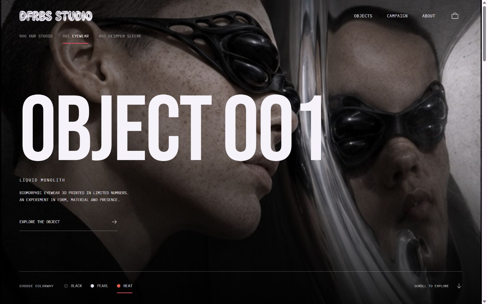
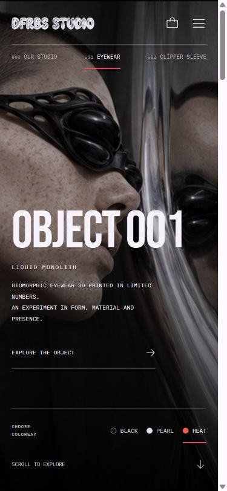

# Immersive campaign QA — October 5, 2026

Approved scope: amplify the existing sculptural fashion campaign with product presentation, typography, purposeful motion and mobile navigation. Existing product imagery, anatomy, prices and studio composition are preserved.

## Verification

- Production build passed using Vite's supported `--configLoader runner` loader. The default bundler is blocked by the local Windows sandbox's ancestor-directory access; source and build configuration remain unchanged.
- Unchanged Sites packaging completed; all 4 Sites worker tests passed. Required client, server and hosting outputs exist.
- `git diff --check` passed. The design detector returned no findings.
- Desktop (1440 × 900), mobile (390 × 844), and intermediate 768/1000 px checks passed without horizontal overflow.
- Bare root, `?object=000`, `?object=001`, and `?object=002` navigated successfully. Browser Back while a purchase panel was open closed the panel, restored scrolling, and restored the previous object.
- Color selection updates the campaign, product, collection and purchase panel. Radio controls support arrow keys and Home/End; selected controls expose state.
- Film pause/play and sound toggles were verified through actual video playback properties; muted autoplay, loop and inline defaults remain intact.
- Menu and purchase panel focus the close control, wrap keyboard focus, close with Escape, restore the opener, and make the background inert while open.
- Prototype add-to-bag confirmation, count and polite status feedback passed. The existing prototype has no payment or inventory backend.
- No application warnings or errors were captured during the browser checks.
- Fresh independent visual/code review approved; final tablet type, mobile caption and scrolling adjustments were accepted with no required fixes.

## Preview evidence





## Reproduction

```sh
npm ci
npm run build
npm run test:sites
```

For the restricted local Windows environment, the equivalent verified build is:

```sh
node node_modules/vite/bin/vite.js build --configLoader runner
node scripts/prepare-sites-build.mjs
npm run test:sites
```
